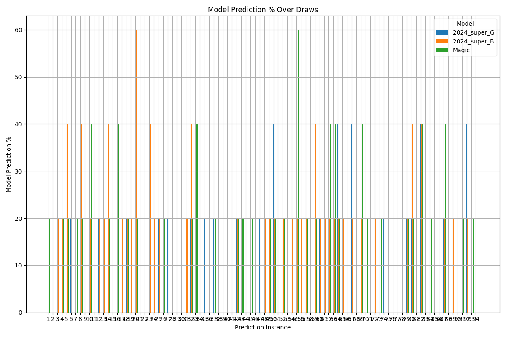
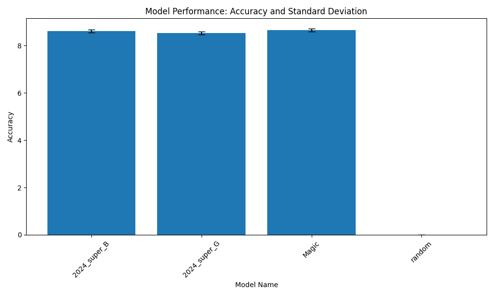

# P_Project_EL (WIP/TBC)
## Binary Representation:


## K-cluster:


## Interpreter [NotRF]:


## Overview
**Simple Innovative Technology Device & AI To Predict The Future.**

What this project opens up as a possibility, is truly staggering. Imagine being able to make accurate predictions of any future event at any temporal distance. The project explores the possibility of making predictions across various domains, including financial markets, lotteries, and real-time events like roulette spins. (WIP/TBC)

## Motivation
The motivation behind this project is to challenge the conventional understanding of time and events. It explores the idea that everything may already be determined, and our perception merely observes the unfolding of pre-existing events, akin to a needle tracing a record.

Impossible it would seem, but what if the real truth is everything is written? Could this be a possibility? Akashic Records, Remote Viewing, NDEs all show a glimmer. The glimmer leads to attention, and attention is ALL.

### The Dataset Challenge [Time & xPU-Power] 
These models have only seen 150,000 datasets from the min tot of 2,658,391,066 

a minimum of 2,658,391,066 datasets needed that is just 1 dataset per possibility! 

each dataset is 2 similar images one for input1 and one for input2

2 images size 13.2 KB = 13,532 bytes
```python
# Given data
num_combinations = 2_658_391_066
storage_per_combination_bytes = 13_532

# Calculate total storage in bytes
total_storage_bytes = num_combinations * storage_per_combination_bytes

# Convert bytes to gigabytes
total_storage_gb = total_storage_bytes / (1024 * 1024 * 1024)
total_storage_gb
```
Result
33502.79098852724
approximately 33,502.79 GB

1 TB = 1,024 GB
approximately 32.72 TB


## Description
This part of the project attempts to predict future UK lotteries using data generated before the event. The data will be added days before the event. (WIP/TBC)

## Current Progress
Predicting 5 numbers and getting 2/3 correct repeatedly shows a level of consistency that is remarkable, even with these under-trained models.

It is time to seek attention to this project to potentially verify this is a real effect/phenomenon.

- **Live Demonstration**: This project was demonstrated live on X.com (previously Twitter) from November to December 2023. @M0000000000004
- Follow me on X [https://www.x.com/@M0000000000004]
- **Published Predictions**: Predictions were published between 24 hours to 1 week prior to the lottery draw.
- **Data Storage**: Data is stored in the target date directory with the generation time as the timestamp.
- **UK Lottery Results**: All UK Lottery results take place after 19:30 (H:M) on SAT/WED.

The great thing about this project is it is real and you can run it on your system to verify before the event happens, making it impossible to cheat. I am hoping to generate a buzz around this as the implications are incomprehensible.

## Reports
- **Report Headers**: `creation_date`, `el_model`, `yp`, `indices`, `label`, `matching`, `result_date`
- **Sample Data**:
    ```
    creation_date                                           | el_model | yp | indices | label | matching | result_date
    [2][C][readings/Sat-16-09-2023/2023-09-16T16-2...]  | C        |    |         |       |         | Sat-16-09-2023
    [3][M][readings/Sat-16-09-2023/2023-09-16T17-3...]  | M        |    |         |       |         | Sat-16-09-2023
    [4][N][readings/Wed-20-09-2023/2023-09-17T15-2...]  | N        |    |         |       |         | Wed-20-09-2023
    [5][C][readings/Wed-20-09-2023/2023-09-17T15-5...]  | C        |    |         |       |         | Wed-20-09-2023
    [6][A][readings/Wed-20-09-2023/2023-09-17T18-3...]  | A        |    |         |       |         | Wed-20-09-2023
    ```

## Model Files
- **Model Size on Disk**:
    - `best_model.h5`  0.99 GB (1,073,491,968 bytes)
    - `model_architecture.json` 12.0 KB (12,288 bytes)
    - `model_weights.h5` 341 MB (357,842,944 bytes)

## Images from Model Analysis
- **Reports**:
    - `reports/report_history_14_Jul_2024_062216.csv`
    - `reports/report_history_14_Jul_2024_053258.csv`
    - `reports/report_history_14_Jul_2024_043109.csv`
    - `reports/predictions_vs_correct.png`
    - `reports/predictions_over_time.png`
    - `reports/model_prediction_percent.png`
    - `reports/model_performance.png`
    - `reports/full_lottery_percent.png`
    - `reports/combined_report_history.csv`






## License
This project is licensed under the MIT License for personal, educational, and non-commercial use. For commercial use, please contact Mince at mince@foldingcircles.co.uk to obtain a commercial license.

## Commercial License
Commercial use of this software requires a separate commercial license. To inquire about commercial licenses, please contact Mince at mince@foldingcircles.co.uk.

## Contributing
We welcome contributions from the community! By contributing to this project, you agree to license your contributions under the same terms as the project's open-source license and grant the original author a perpetual, worldwide, non-exclusive, royalty-free license to use, modify, distribute, and commercialize your contributions.
